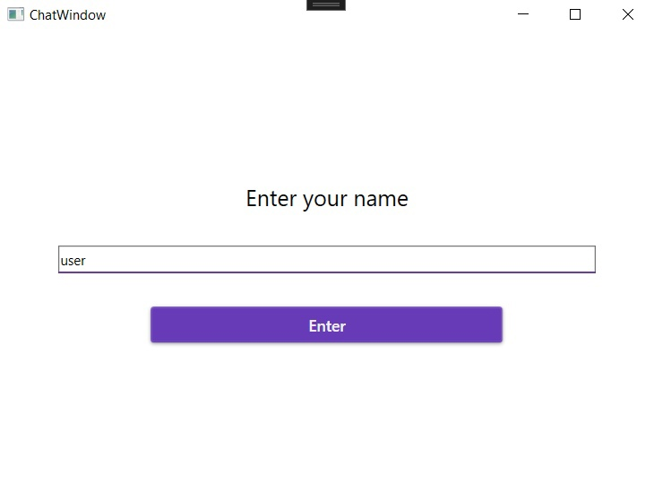
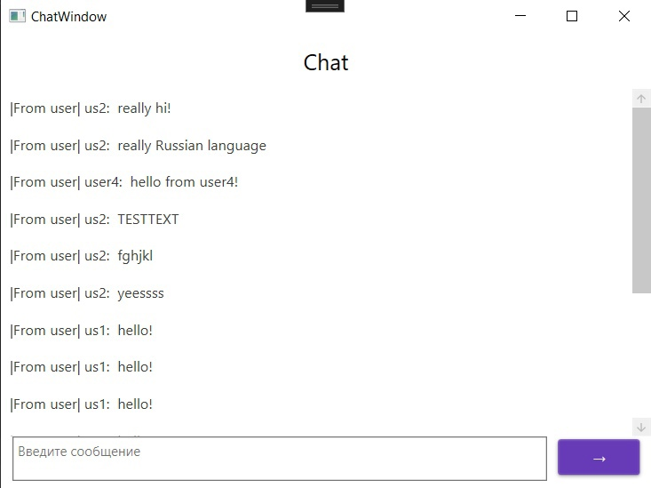

# Промышленное программирование. Проект № 2

## Вариант 3: Чат

### Серверная технология: SignalR
### Пользовательский интерфейс реализован на WPF
### Хранение данных: XML

### Проект представляет собой чат между пользователями или группой пользователей. Пользователи могут общаться в режиме реального времени.

### Функкционал:
* хранение информации о пользователях на сервере
* поддержка групповых чатов с сохранением истории и состава группы на сервере

Окно ввода имени пользователя:

Окно чата:

