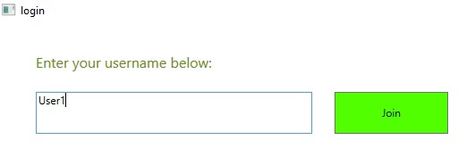
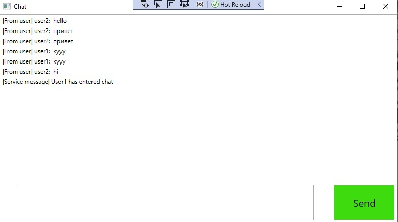

# Промышленное программирование. Проект № 2

## Вариант 3: Чат SignalR + JSON
Технология клиент-сервер SignalR, хранение данных (история сообщений в личку и в группах) в формате JSON, 
пользовательский интерфейс реализован с помощью WPF.

## Проект - многопользовательский чат в режиме реального времени
Реализованный функционал:
* Сервер, который может одновременно обслуживать нескольких пользователей
* Графический клиент
* Сохранение личных и групповых сообщений на сервере и их воспроизведение

  
<strong>Вход в чат: </strong>

  

  
  

  
<strong>Непосредственно чат</strong>

  

  
  

